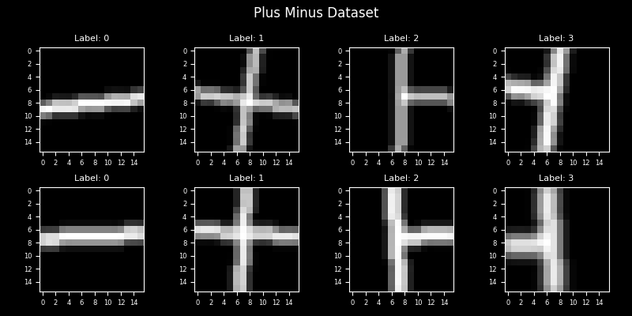
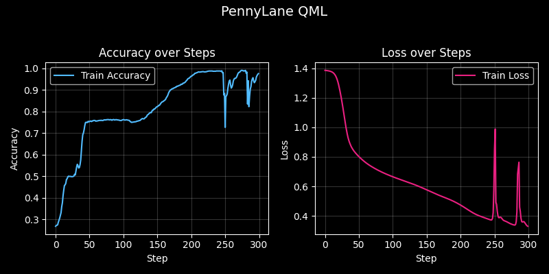

# Quantum vs Classical Image Classification

A comparative study of classical machine learning (ML) and quantum machine learning (QML) approaches for image classification using the Plus Minus dataset.

## Overview

This project implements and compares three different approaches to solve the same 4-class image classification problem:

- **Classical ML**: Convolutional Neural Network using TensorFlow/Keras
- **PennyLane QML**: Variational quantum classifier with automatic differentiation
- **Qiskit QML**: Low-level quantum circuit implementation with manual gradient computation

## Dataset

The Plus Minus dataset from PennyLane contains:
- 1000 training samples (16x16 grayscale images)
- 200 test samples
- 4 classes of geometric patterns

<div align="center">
  
</div>

## Requirements

Install dependencies using:
```bash
pip install -r requirements.txt
```

## Usage

Run individual implementations:
```bash
python image_classification_classical.py    # Classical ML
python image_classification_pennylane.py    # PennyLane QML
python image_classification_qiskit.py       # Qiskit QML
```

Or run all approaches:
```bash
python main.py
```

## Results

| Approach | Time per Step | Active Training* | Test Accuracy | Complexity |
|----------|---------------|----------|----------|------------|
| Classical ML | 0.38 seconds | 2 epochs | 100% | Low |
| PennyLane QML | ~0.41 seconds | 220 steps | ~98% | Medium |
| Qiskit QML | ~2.8 minutes | 300 steps | ~99% | High |

**Active Training refers to the period during which the model is actively being trained until the learning rate leads to a plateau in improvement—meaning the training loss and accuracy stabilize and further optimization yields diminishing returns or no significant progress.*
### Training Performance Visualization
<div align="center">
  
</div>
<div align="center">
  
</div>
<div align="center">
  
</div>

### Key Findings

- **Classical ML** achieves perfect accuracy in seconds
- Quantum approaches require significantly more computational time
- Both approaches achieve around 98% test accuracy, but **Qiskit** required nearly three times longer to train; however, its learning process was much more stable, whereas **PennyLane** exhibited fluctuations during training.
- The results on both QML approaches may change with further hyperparameter tuning

## File Structure

```
qc-image-classification/
├── image_classification_classical.py      # Classical ML implementation
├── image_classification_pennylane.py      # PennyLane QML implementation  
├── image_classification_qiskit.py         # Qiskit QML implementation
├── main.py                                # Run all approaches
├── requirements.txt                       # Dependencies
├── output/                                # Generated plots and results
└── datasets/                              # Auto-downloaded dataset
```

## Dependencies

- Python 3.8+
- TensorFlow
- PennyLane
- Qiskit
- NumPy
- Matplotlib

## License

MIT License